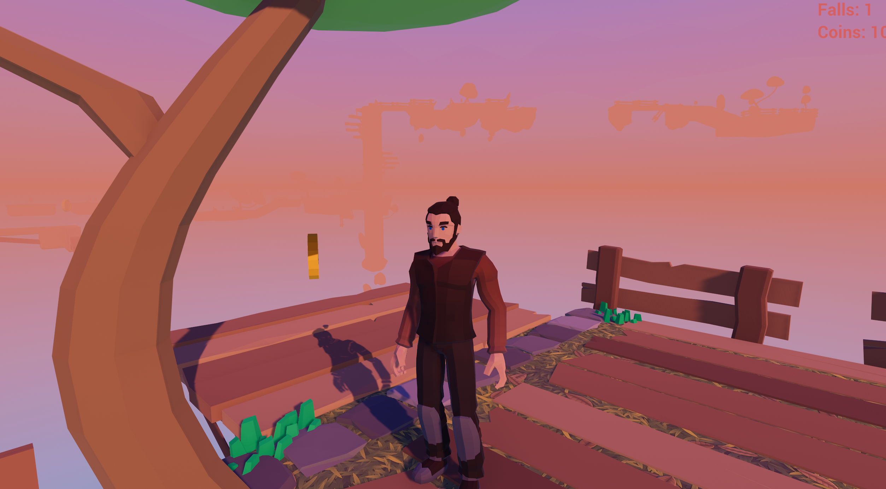

# 3D Virtual Environments and Applications - Island Hopper

This repository contains the Unity project for "Island Hopper," a 3D third-person platformer where the player navigates a series of floating islands to reach the final platform.  The game includes some precise jumps, balancing challenges, and interaction with these core mechanics. This small project was mainly made for University of Oulu's "3D Virtual Environments and Applications" -course. I thought the project was quite fun for my first real game, and thought why not put it up here for people to check it out. 

## Table of Contents

* [Introduction](#introduction)
* [Gameplay](#gameplay)
* [Features](#features)
* [Screenshots](#screenshots)
* [Controls](#controls)
* [Technical Details](#technical-details)
* [Installation](#installation)
* [Future Development](#future-development-perhaps)
* [Credits](#credits)

## Introduction

Island Hopper is a small challenging platformer experience. Players must master a variety of movement techniques to traverse the treacherous floating islands. The game features a checkpoint system to mitigate frustration, optional collectibles for added challenge, and a dynamic environment that evolves as the player progresses.

## Gameplay

The player controls a character in a third-person perspective. The primary goal is to reach the final platform of each level by completing a series of platforming challenges. These challenges involve timed jumps, balancing on narrow beams, and interacting with environmental elements like pressure plates. Falling off the map will return the player to the last checkpoint. Sixty optional coins are scattered throughout the levels, providing an extra layer of challenge for completionists.

## Features

* **Challenging Platforming:**  Test your skills with tight jumps, balancing acts, and environmental puzzles.
* **Checkpoint System:**  Never start from the beginning. Checkpoints ensure progress is saved even after falls. Checkpoints have been set to specific locations at key locations on the map.
* **Collectibles:** Gather 60 optional coins for an added layer of challenge.
* **Engaging Atmosphere:**  Experience a stylized sunset environment enhanced by dynamic lighting and soundscapes.
* **Controller Support:** Enjoy smoother animations and a more comfortable experience with a standard controller.
* **NPC Interaction:** Engage in dialogue with two goofy cat NPCs.

## Screenshots

* **The player character standing in idle. What is he thinking about?**  
* **You can see some of the islands on the background!**
* **Running up that road. Running up that hill.** 
* **Platforming in progress. Oh, it seems that jump might not end well.** 

## Controls

* **Movement:** WASD or Left Stick (PS Controller)
* **Sprint:** Shift or X Button (PS Controller)
* **Jump:** Spacebar or O Button (PS Controller)
* **Interact:** E

## Technical Details

* **Engine:** Unity
* **Perspective:** Third-Person. Implemented in a way that does not clip with environment.
* **Lighting:** Static with dynamic skybox and shader for sunset effect
* **Materials/Shaders:** PBR materials using textures from online resources, custom shaders for specific effects, post-processing for enhanced visuals.
* **Animations:** Blend tree system for smooth transitions between animations. Animations included for idle, walk, jog, sprint, jump, falling and landing.
* **Physics:** Rigidbody-based player movement with interpolation for moving platforms.
* **Audio:** Dynamic soundscapes with wind and environmental sounds, distinct coin collection sound.
* **Performance Optimization:** Low-poly assets, optimized post-processing, and URP for lighter rendering.

## Installation

1. Clone this repository.
2. Execute the `IslandHopper.exe`-file.
3. This should build the game, and immediately run it. Simple as that!

## Future Development (perhaps)

* More levels with increasing complexity.
* Additional gameplay mechanics.
* Enhanced AI and features for NPCs.
* Polishing and bug fixes.

## Credits

* **Game Developer:** Santeri Heikkinen
* **Assets:**  [Unity Asset Store](https://assetstore.unity.com/)
* **Textures:** [Poliigon.com](https://www.poliigon.com/textures/free)
* **Sound Effects:** [Freesound.org](https://freesound.org/)